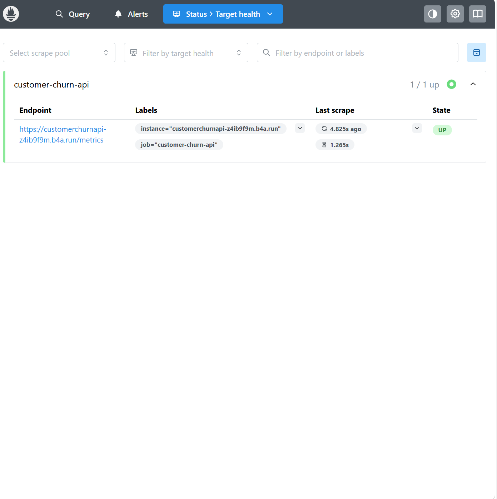

# Submission 1: Customer Churn Prediction
Nama: Muhammad Adha

Username dicoding: muhammad_adha

| | Deskripsi |
| ----------- | ----------- |
| Dataset | [Customer Churn Dataset (Synthetic)](https://github.com/adha20/ml-ops-submission) |
| Masalah | Banyak perusahaan kehilangan pendapatan karena pelanggan berhenti berlangganan layanan mereka (churn). Mengidentifikasi pelanggan yang kemungkinan besar akan *churn* secara manual sangat sulit, sehingga dibutuhkan pendekatan otomatis agar perusahaan dapat mengambil tindakan retensi secara proaktif. |
| Solusi machine learning | Mengembangkan model klasifikasi biner berbasis Deep Learning (TensorFlow/Keras) yang dibungkus dalam *machine learning pipeline* end-to-end otomatis menggunakan TensorFlow Extended (TFX). |
| Metode pengolahan | Data mentah (CSV) diproses menggunakan komponen TFX Transform. Fitur numerik (seperti customer_age, monthly_charges, 	enure, 	otal_usage) diskalakan menggunakan z-score (standardisasi). Fitur kategorikal (gender, contract_type) dikonversi menjadi representasi *vocabulary* numerik. |
| Arsitektur model | Model ini menggunakan arsitektur neural network (*feed-forward*) yang dibangun dengan framework TensorFlow/Keras. Terdapat *input layer* untuk fitur kategorikal dan numerikal. *Hidden layer* terdiri dari dua Dense layer hasil *hyperparameter tuning* dengan konfigurasi units_1 = 16, units_2 = 32, dan learning_rate = 0.01. *Output layer* menggunakan aktivasi sigmoid untuk klasifikasi biner. |
| Metrik evaluasi | Metrik utama yang digunakan pada TFX Evaluator adalah **BinaryAccuracy** dengan batas bawah kelulusan (threshold) ditetapkan sebesar 0.5 (50%), didukung oleh penghitungan ExampleCount, AUC, True Positives, dll. |
| Performa model | Model sukses di-*training* dan berhasil mendapatkan *blessing* (kelulusan) dari komponen TFX Evaluator. Hasil metrik pengujian menunjukkan bahwa model mencapai **BinaryAccuracy = 0.7857 (78.57%)** dan **AUC = 0.5510**, yang memenuhi ambang batas yang dikonfigurasi pada *eval_config*. |
| Opsi deployment | Model di-*deploy* menggunakan layanan *Cloud Platform* (Back4App) dengan container berbasis **TensorFlow Serving** (	ensorflow/serving:latest). Model Serving mengekspos endpoint REST API untuk melayani prediksi dan menyajikan metrik internal Prometheus. |
| Web app | Tautan web app yang digunakan untuk mengakses model serving: [customer-churn-model-metadata](https://ml-ops-submission-production.up.railway.app/v1/models/customer-churn-model)    Endpoint Prediksi: [Predict](https://ml-ops-submission-production.up.railway.app/v1/models/customer-churn-model:predict) |
| Monitoring | Sistem monitoring menggunakan Prometheus untuk melakukan *scraping* metrik dari TF Serving. Selama tahap pengujian berjalan, terekam lonjakan metrik latensi dan jumlah *request* pada sistem. Endpoint eksportir metrik Prometheus dapat diakses publik pada tautan berikut: [Prometheus Metrics Endpoint](https://ml-ops-submission-production.up.railway.app/monitoring/prometheus/metrics) |

